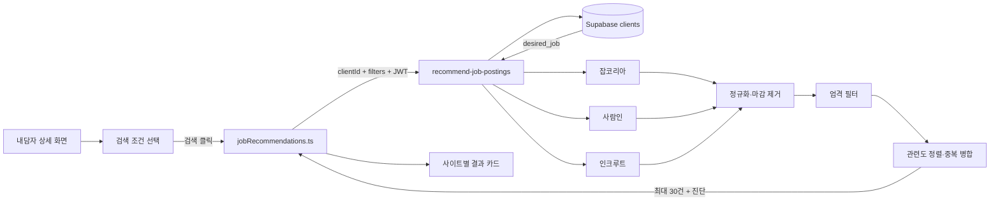

# 채용공고 추천 기능 구현 문서

> 담당: rrealhjung · 작성 기준일: 2026-08-27 · 대상: 개발자, 배포 담당자, 기능 인수인계 담당자
>
> 사용자용 안내: [채용공고 추천 기능 사용 매뉴얼](./채용공고-추천-사용매뉴얼.md)

## 1. 작업 목적

Supabase DB에 저장된 내담자의 `희망직종`을 기준으로 잡코리아·사람인·인크루트의 공개 채용공고를 조회하고, 상담사가 선택한 학력·신입/경력·지역 조건과 명시적으로 일치하는 공고를 추천하는 기능을 구현했다.

핵심 목표는 다음과 같다.

- 내담자 상세 화면에서 상담 흐름을 벗어나지 않고 채용공고를 확인한다.
- `요약 및 분석`과 `챗봇` 사이에 `채용공고 추천` 탭을 제공한다.
- 탭 진입만으로 외부 사이트를 호출하지 않고 상담사가 `검색`을 눌렀을 때만 조회한다.
- 잡코리아·사람인·인크루트 세 사이트만 사용한다.
- 마감된 공고와 신뢰할 수 없는 공고를 제외한다.
- 동일 공고를 하나로 합치고 원문 링크는 모두 보존한다.
- 내담자의 희망직종 관련도가 높은 공고를 먼저 표시한다.
- 구체적인 검색 조건을 선택한 경우 조건을 확인할 수 없는 공고를 섞지 않는다.
- 인증된 상담사 또는 관리자만 담당 내담자의 희망직종을 조회할 수 있게 한다.

## 2. 구현 범위

| 구분 | 구현 내용 |
|---|---|
| 상세 화면 탭 | `채용공고 추천` 탭 추가 및 추천 화면 연결 |
| 검색 UI | 학력, 신입·경력, 경력 연수, 지역, 검색 버튼 |
| 지역 데이터 | 17개 시·도와 228개 시·군·구의 검색 가능한 표준 목록 |
| 프런트 API | Supabase Edge Function 호출, 응답 검증, 클라이언트 캐시 |
| 데이터 조회 | DB의 최신 `clients.desired_job`을 서버에서 직접 조회 |
| 스크래핑 | 잡코리아, 사람인, 인크루트 공개 검색 HTML 조회 및 파싱 |
| 결과 처리 | 마감 제거, 엄격 필터, 관련도 정렬, 중복 병합, 개수 제한 |
| 보안 | 사용자 JWT 검증, RLS 적용, 상담사-내담자 담당 관계 재검증 |
| 운영 지원 | 사이트별 진단, 부분 실패 처리, 캐시, 새로고침 제한 |
| 검증 | 프런트·Edge 타입 검사, 파서·필터·정렬·계약 테스트 |

## 3. 전체 처리 흐름



실제 요청 순서는 다음과 같다.

1. 상담사가 내담자 상세 화면의 `채용공고 추천` 탭을 연다.
2. 학력·신입/경력·지역 조건을 선택한다. 이 단계에서는 외부 요청이 발생하지 않는다.
3. `검색`을 누르면 브라우저가 로그인 세션의 JWT와 함께 `clientId`, `filters`를 Edge Function으로 보낸다.
4. Edge Function이 JWT를 검증하고 RLS가 적용된 사용자 컨텍스트로 `clients.desired_job`을 조회한다.
5. 로그인 사용자가 해당 내담자를 조회할 수 있는 상담사 또는 관리자인지 다시 확인한다.
6. 희망직종을 최대 3개로 분리하고 세 채용사이트를 조회한다.
7. 공고를 정규화하고 마감 공고를 제거한 뒤 선택 조건을 엄격하게 적용한다.
8. 관련도 정렬과 중복 병합을 수행하고 최종 최대 30건을 반환한다.
9. 화면은 전체 및 사이트별 건수, 공고 카드, 부분 실패 진단을 표시한다.

## 4. 검색 조건 UI와 규칙

### 4.1 학력

4열 2행의 8개 항목을 제공하며, 선택된 항목은 체크 아이콘 없이 가운데 정렬된 텍스트와 배경색으로 구분한다.

- 학력 무관
- 고교 졸업 이하
- 고등학교 졸업
- 대학 졸업(2, 3년제)
- 대학교 졸업(4년제)
- 대학원 석사 졸업
- 대학원 박사 졸업
- 박사 졸업 이상

구체적인 학력은 여러 개 선택할 수 있다. `학력 무관`은 다른 학력과 상호 배타적이며, 선택된 구체 학력을 모두 해제하면 자동으로 `학력 무관`으로 돌아간다.

### 4.2 신입·경력

- 경력 무관
- 신입
- 경력

`신입`과 `경력`은 동시에 선택할 수 있다. `경력 무관`은 다른 경력 조건과 상호 배타적이다.

`경력`을 선택한 경우에만 다음 연수 조건을 사용할 수 있다.

- `1년 이하`
- `N년 이상`: 1~99의 숫자 입력

두 연수 조건은 동시에 적용되지 않는다. `경력` 선택을 해제하면 연수 조건과 입력값도 초기화한다.

### 4.3 지역

자유 입력값을 그대로 서버에 보내지 않고, 검색 가능한 표준 목록에서 선택한 코드와 이름을 전송한다.

- `지역 무관`
- 17개 시·도
- 228개 시·군·구
- 최대 10개 다중 선택
- 선택값을 태그로 표시하고 개별 해제 가능
- 시·도 선택 영역 클릭은 해당 시·도만 선택
- 별도 펼침 버튼을 눌렀을 때만 하위 시·군·구 표시
- 시·도와 그 하위 지역을 함께 선택하면 서버 정규화 과정에서 시·도 선택을 우선

### 4.4 조건 결합 방식

- 같은 범주의 여러 값: OR
- 학력·신입/경력·지역 범주 사이: AND
- `무관` 선택: 해당 범주를 제한하지 않음
- 구체 조건 선택: 공고에 같은 조건이 명시된 경우만 통과
- 구체 조건 검색에서 값이 없거나 `학력 무관`, `경력 무관`, `전국/지역 무관`인 공고: 제외

마지막 규칙은 사용자가 선택한 조건과 완전히 부합하는 공고만 표시하기 위해 적용한 fail-closed 정책이다.

## 5. 프런트엔드 동작

`JobRecommendationsTab`은 다음 상태를 관리한다.

- 작성 중인 조건과 마지막으로 제출한 조건 분리
- 검색 전 빈 화면, 로딩, 성공, 오류 상태
- 전체·잡코리아·사람인·인크루트 사이트 필터
- 동일 요청의 10분 클라이언트 캐시
- 조건 변경 시 이전 결과와 제출 조건 초기화
- 새로고침 시 마지막 제출 조건으로 `refresh: true` 요청

검색 성공 시 사이트 필터는 `전체`로 돌아간다. 이후 사이트 버튼을 누르면 해당 사이트 링크를 가진 공고만 표시한다. 예를 들어 `전체 18`, `잡코리아 0`, `사람인 7`, `인크루트 11`인 상태에서 `잡코리아 0`을 선택하면 결과 영역에는 잡코리아의 0건 상태만 표시된다. 전체 추천이 0건이라는 의미는 아니다. 여러 사이트의 중복 공고를 합친 카드는 복수 링크를 가지므로 두 개 이상의 사이트 건수에 동시에 포함될 수 있으며, 사이트별 건수의 합이 항상 `전체`와 같지는 않다.

프런트는 응답의 원문 링크가 허용된 세 사이트의 HTTPS 도메인인지 다시 검사하며, 마감 시각이 지난 캐시 결과도 화면에 표시하기 전에 제거한다.

## 6. Edge Function 요청·응답 계약

### 6.1 요청

```json
{
  "clientId": "00000000-0000-4000-8000-000000000000",
  "filters": {
    "education": ["bachelor", "master"],
    "experience": {
      "types": ["entry", "experienced"],
      "range": { "kind": "minimum-years", "years": 3 }
    },
    "regions": [
      { "code": "seoul/gangnam-gu", "label": "서울특별시 강남구" }
    ]
  },
  "refresh": true
}
```

일반 검색에서는 `refresh`를 생략한다. 사용자가 결과 화면의 `새로고침`을 누른 경우에만 `true`를 보낸다.

### 6.2 성공 응답의 핵심 필드

| 필드 | 의미 |
|---|---|
| `desiredJob` | DB에서 다시 조회해 실제 검색에 사용한 희망직종 |
| `results` | 정렬·중복 제거가 끝난 추천 공고 배열 |
| `fetchedAt` | 조회 기준 시각 |
| `partial` | 일부 사이트 또는 검색어 요청이 실패했는지 여부 |
| `sources` | 사이트별 수집·반환·제외 건수 및 실패 메시지 |
| `filterContractVersion` | 현재 필터 계약 버전 `1` |
| `appliedFilterKey` | 서버가 실제 적용한 정규화 필터의 결정적 직렬화 값 |

프런트는 요청 필터로 계산한 키와 `appliedFilterKey`가 다르거나 계약 버전이 `1`이 아니면 결과를 거부한다. 이전 Edge Function이 새 필터를 조용히 무시해 조건에 맞지 않는 공고를 보여주는 문제를 방지하기 위한 보호 장치다. 프런트 계약을 변경하면 Edge Function을 함께 배포해야 한다.

## 7. 인증·권한·입력 보안

인증과 데이터 연결은 다음 관계를 기준으로 한다.

```text
auth.users.id
  = public."user".user_id
  = public.counselors.auth_user_id

public.clients.counselor_id
  = public.counselors.id
```

Edge Function은 service-role 키를 사용하지 않는다. 호출자의 JWT를 사용하는 Supabase 클라이언트로 DB를 조회하므로 기존 RLS가 그대로 적용된다. 추가로 관리자 역할 또는 담당 상담사의 `counselors.id`와 `clients.counselor_id` 관계를 확인한다. 권한이 없는 경우 데이터 존재 여부를 노출하지 않도록 `CLIENT_NOT_FOUND`로 처리한다.

그 밖의 보호 규칙은 다음과 같다.

- POST와 JSON 요청만 허용
- 요청 본문 최대 8 KiB
- `clientId` UUID 형식 검증
- 희망직종 최대 3개, 각 검색어 최대 80자
- 이메일·전화번호 등 민감 식별자 형태가 포함된 검색어 거부
- 외부 요청과 결과 링크 모두 사이트별 HTTPS 호스트 allowlist 적용
- 외부 HTML 응답 최대 4 MiB
- 사이트별 요청 제한 시간 9초
- 리디렉션 최대 3회이며 매 단계 호스트 재검증
- 403, 429, CAPTCHA 및 구조 변경을 우회하지 않고 부분 실패로 처리

## 8. 스크래핑과 결과 처리 파이프라인

### 8.1 사이트 조회

세 사이트는 병렬로 조회한다. 한 사이트 안에서 희망직종이 여러 개인 경우에는 과도한 동시 요청을 피하기 위해 순차적으로 조회한다. 희망직종 3개이면 최대 9번의 외부 요청이 발생할 수 있고, 같은 사이트의 요청은 각각 최대 9초 제한을 적용받는다.

| 사이트 | 검색 결과에서 수집하는 주요 정보 | 현재 특징 |
|---|---|---|
| 잡코리아 | 제목, 회사, 지역, 경력, 마감 | 모바일 검색 목록에 학력 정보가 없음 |
| 사람인 | 제목, 회사, 지역, 경력, 학력, 고용형태, 게시·마감 정보 | HTML 조건 영역을 파싱 |
| 인크루트 | 제목, 회사, 지역, 경력, 학력, 고용형태, 마감 정보 | EUC-KR 응답을 고려해 디코딩 |

각 파서는 검색어별 첫 페이지에서 최대 60개의 원시 후보만 읽는다. 학력·경력·지역 조건을 채용사이트 검색 URL에 전달하지 않고 수집 후 서버에서 필터링하므로, 첫 페이지 뒤쪽에는 적합한 공고가 있어도 현재 결과에는 포함되지 않을 수 있다.

### 8.2 정규화와 마감 제거

- HTML 엔티티, 공백, 텍스트 길이를 정규화한다.
- 허용되지 않은 URL은 공고 자체를 제외한다.
- `마감`, `종료` 등 명시적 종료 공고를 제외한다.
- 날짜 또는 당일 마감 시각이 지난 공고를 제외한다.
- 마감 형식을 해석할 수 없는 공고도 신뢰할 수 없으므로 제외한다.
- `상시채용`, `채용시 마감`은 종료가 확인되지 않은 공고로 유지한다.

사이트 진단의 `excludedExpired`는 구현상 `원시 공고 수 - 정규화 통과 수`다. 따라서 실제 마감 공고뿐 아니라 필수 필드 누락, 허용되지 않은 URL, 알 수 없는 마감 형식으로 제외된 공고도 이 값에 포함된다.

### 8.3 엄격 필터

서버가 학력·경력·지역 값을 다시 정규화하고 검증한 뒤 공고 메타데이터에 적용한다. 구체적인 조건을 선택한 상태에서는 정보가 없거나 `무관/전국`인 공고를 통과시키지 않는다. 필터는 스크래핑 결과 수와 관계없이 항상 서버에서 적용한다.

### 8.4 관련도 정렬

엄격 필터를 통과한 후보만 다음 우선순위로 정렬한다.

1. 공고 제목과 DB 희망직종의 정규화된 정확 일치
2. 제목 안의 희망직종 구문 포함 또는 반대 방향 포함
3. 제목의 부분 토큰·문자 일치
4. 실제 검색에 사용된 희망직종과 제목의 보조 일치도
5. 선택 조건의 구체적인 일치도
6. DB에 입력된 희망직종 순서
7. 최신 게시일
8. 제목·회사·사이트·공고 ID 기반의 결정적 순서

검색 결과에 포함됐다는 사실만으로 관련도 점수를 주지 않으며, 제목과 희망직종의 실제 일치를 우선한다.

현재는 관련도 최소 통과 점수를 두지 않는다. 따라서 채용사이트가 희망직종 검색 결과로 반환했고 엄격 조건까지 통과했지만 제목 관련도 점수가 0인 공고도 결과 여유가 있으면 뒤쪽에 남을 수 있다.

### 8.5 중복 병합

다음 기준을 단계적으로 적용한다.

1. 같은 사이트의 동일 공고 ID
2. 정규화된 동일 URL
3. 서로 다른 사이트의 회사명·공고 제목 fingerprint

3번은 지역과 마감 조건이 호환되고, 이미 같은 사이트 링크가 합쳐져 있지 않은 경우에만 적용한다. 병합 시 정보가 더 풍부한 공고를 기준으로 누락 필드를 보완하고 각 사이트의 원문 링크를 모두 보존한다.

### 8.6 결과 개수 제한

```ts
const MAX_RESULTS_PER_SOURCE = 12;
const MAX_TOTAL_RESULTS = 30;
```

- 관련도 정렬과 사이트 내부 중복 제거 후 사이트별 최대 12건
- 세 사이트 결과를 합쳐 다시 중복 제거·정렬한 뒤 최종 최대 30건
- 현재 페이지네이션이나 추가 불러오기는 없음

## 9. 캐시·재요청 제한·진단

| 항목 | 현재 값 |
|---|---:|
| 프런트 동일 요청 캐시 | 10분 |
| Edge 성공 응답 캐시 | 10분 |
| Edge 부분/전체 실패 캐시 | 1분 |
| 강제 새로고침 제한 | 사용자·내담자·검색 조건별 30초 |
| Edge 캐시 최대 항목 | 200개 |

Edge 캐시는 warm isolate의 메모리 캐시이므로 영구 저장소가 아니며 인스턴스 사이에서 공유되지 않는다. 같은 키의 동시 요청은 하나의 진행 중인 스크래핑 작업으로 합친다.

사이트별 진단에는 다음 값이 포함된다.

- `fetched`: 검색 HTML에서 읽은 원시 공고 수
- `returned`: 최종 결과에서 해당 사이트 링크를 가진 공고 수
- `excludedExpired`: 마감 또는 신뢰할 수 없는 마감 정보로 제외된 수
- `excludedByFilter`: 학력·경력·지역 조건으로 제외된 수
- `excludedDuplicate`: 사이트 내부 중복 제거 수
- `status`, `message`: 성공 여부와 공개용 실패 사유

일부 요청만 실패하면 성공한 사이트 결과를 `partial: true`로 반환한다. 모든 사이트·검색어 요청이 실패하면 `ALL_SOURCES_FAILED` 오류를 반환한다.

## 10. 사이트별 제약과 화면 해석

### 잡코리아 학력 정보

현재 잡코리아 검색 목록 파서는 학력 값을 얻지 못한다. 따라서 `학력 무관`이 아닌 구체 학력을 선택하면 학력 조건을 확인할 수 없어 잡코리아 공고가 모두 제외될 수 있으며, 현재 구현에서는 `잡코리아 0`이 정상적인 엄격 필터 결과다.

이 경우에도 사람인·인크루트 결과는 존재할 수 있다. `전체` 건수가 0보다 크지만 `잡코리아 0` 버튼이 선택되어 있다면 결과 영역의 0건 안내는 잡코리아에만 해당한다.

### 공개 HTML 스크래핑

- 사이트의 HTML 구조가 바뀌면 파서가 결과를 읽지 못할 수 있다.
- 403, 429, CAPTCHA, 네트워크 지연으로 일부 사이트가 일시적으로 실패할 수 있다.
- 사이트 버튼에 숫자가 보이면 해당 사이트 조회는 성공했으며 최종 반환 건수를 뜻한다.
- 숫자 대신 경고 아이콘이 보이면 해당 사이트 조회가 실패한 상태다.
- 버튼에 마우스를 올리면 조건·마감·중복 제외 수 또는 실패 사유를 확인할 수 있다.

## 11. 주요 파일

| 파일 | 역할 |
|---|---|
| [`ClientDetail.tsx`](../../client/src/pages/counselor/ClientDetail.tsx) | 상세 화면 탭 위치와 추천 탭 렌더링 |
| [`JobRecommendationSearchControls.tsx`](../../client/src/pages/counselor/JobRecommendationSearchControls.tsx) | 학력·경력·지역 선택 UI와 검색 제출 |
| [`JobRecommendationsTab.tsx`](../../client/src/pages/counselor/JobRecommendationsTab.tsx) | 화면 상태, 사이트 필터, 진단, 공고 카드 |
| [`jobRecommendations.ts`](../../client/src/lib/jobRecommendations.ts) | 요청·응답 타입, 호출, 캐시, 계약·URL 검증 |
| [`jobRegions.ts`](../../client/src/lib/jobRegions.ts) | 17개 시·도와 228개 시·군·구 표준 데이터 |
| [`recommend-job-postings/index.ts`](../../supabase/functions/recommend-job-postings/index.ts) | 인증, DB 조회, 스크래핑 오케스트레이션, 캐시, 응답 |
| [`fetch-source.ts`](../../supabase/functions/_shared/job-postings/fetch-source.ts) | 외부 HTML 요청 제한과 문자셋 처리 |
| [`jobkorea.ts`](../../supabase/functions/_shared/job-postings/jobkorea.ts) | 잡코리아 검색 URL과 파서 |
| [`saramin.ts`](../../supabase/functions/_shared/job-postings/saramin.ts) | 사람인 검색 URL과 파서 |
| [`incruit.ts`](../../supabase/functions/_shared/job-postings/incruit.ts) | 인크루트 검색 URL과 파서 |
| [`normalize.ts`](../../supabase/functions/_shared/job-postings/normalize.ts) | 마감, URL, 희망직종, 중복 정규화 |
| [`filters.ts`](../../supabase/functions/_shared/job-postings/filters.ts) | 요청 필터 검증과 엄격 매칭 |
| [`ranking.ts`](../../supabase/functions/_shared/job-postings/ranking.ts) | 희망직종 중심 관련도 정렬 |
| [`types.ts`](../../supabase/functions/_shared/job-postings/types.ts) | Edge Function 공통 타입과 응답 계약 |
| [`job_recommendations_clients_rls.sql`](../../supabase/sql/job_recommendations_clients_rls.sql) | 상담사·내담자 조회용 RLS와 ID 연결 보강 |
| [`supabase_user_rls.sql`](../../supabase_user_rls.sql) | 사용자 프로필 조회 권한 기반 |

관련 테스트는 각 구현 파일 옆의 `*.test.ts`와 [`job-postings.test.ts`](../../supabase/functions/_shared/job-postings/job-postings.test.ts), [`job-postings.live.test.ts`](../../supabase/functions/_shared/job-postings/job-postings.live.test.ts)에 있다.

## 12. DB와 배포 준비

운영 또는 테스트 Supabase 프로젝트에서 다음 SQL을 순서대로 실행한다.

1. [`supabase_user_rls.sql`](../../supabase_user_rls.sql)
2. [`job_recommendations_clients_rls.sql`](../../supabase/sql/job_recommendations_clients_rls.sql)

그다음 프로젝트 루트의 PowerShell에서 Edge Function을 배포한다.

```powershell
& "C:\Program Files\nodejs\npx.cmd" --yes supabase@latest login
& "C:\Program Files\nodejs\npx.cmd" --yes supabase@latest functions deploy recommend-job-postings --project-ref 프로젝트_REF
& "C:\Program Files\nodejs\npx.cmd" --yes supabase@latest functions list --project-ref 프로젝트_REF
```

주의사항:

- 앱에 설정된 Supabase URL과 배포 프로젝트가 같아야 한다.
- `--no-verify-jwt`를 사용하지 않는다.
- hosted Edge 환경의 기본 `SUPABASE_URL`, `SUPABASE_ANON_KEY`를 사용하며 별도 service-role secret은 필요하지 않다.
- 프런트 필터 계약 또는 Edge Function 코드를 바꾸면 현재 작업 트리로 함수를 다시 배포한다.
- Docker가 실행 중이 아니라는 경고가 있어도 API 업로드가 완료되고 함수가 `ACTIVE`이면 배포는 성공한 것이다.

2026-08-27 기준 테스트 프로젝트에서 `recommend-job-postings`를 새 필터 계약이 포함된 배포본으로 갱신했고, `ACTIVE`, JWT 검증 활성 상태를 확인했다.

## 13. 검증 방법과 현재 결과

PowerShell 실행 정책 문제를 피하려면 `pnpm.ps1` 대신 다음 명령을 사용할 수 있다.

```powershell
& "C:\Program Files\nodejs\corepack.cmd" pnpm check
& "C:\Program Files\nodejs\corepack.cmd" pnpm check:edge
& "C:\Program Files\nodejs\corepack.cmd" pnpm test
& "C:\Program Files\nodejs\corepack.cmd" pnpm build
```

실사이트 선택 테스트:

```powershell
$env:LIVE_SCRAPE = "1"
& "C:\Program Files\nodejs\corepack.cmd" pnpm vitest run supabase/functions/_shared/job-postings/job-postings.live.test.ts
Remove-Item Env:LIVE_SCRAPE
```

실사이트 테스트는 외부 요청을 발생시키므로 반복 실행하지 않는다.

2026-08-27 검증 기록:

- 프런트 TypeScript 검사 통과
- Edge Function TypeScript 검사 통과
- 전체 자동 테스트 157개 통과, 실패 0개
- 실사이트 선택 테스트 3개는 기본 전체 테스트에서 건너뜀
- 프로덕션 Vite 빌드 성공
- 빌드의 analytics 환경 변수 및 대형 chunk 메시지는 경고이며 빌드 실패가 아님

현재 자동 테스트는 파서 fixture, 마감·URL·중복 정규화, 필터, 랭킹, 프런트 요청 계약과 지역 목록을 중심으로 한다. Edge HTTP handler의 인증·캐시·재요청 제한, 실제 RLS SQL, 검색 조건 UI 컴포넌트 상호작용은 별도의 통합·수동 테스트가 필요하다.

## 14. 알려진 제약과 후속 개선 후보

1. **잡코리아 학력 정보 부재**
   상세 공고 추가 조회 또는 공식 검색 필터 연동 없이는 구체 학력 검색에서 잡코리아가 0건이 될 수 있다. 상세 페이지 조회는 요청 수 증가와 차단 가능성을 함께 검토해야 한다.

2. **최종 30건 제한**
   사이트별 12건, 전체 30건으로 제한하며 페이지네이션이 없다. 더 많은 결과가 필요하면 응답 계약과 UI를 함께 확장해야 한다.

3. **0건 안내 문구의 범위**
   사이트 필터가 선택된 상태의 0건 안내는 전체가 아니라 해당 사이트에만 적용된다. 현재 문구가 전체 결과가 없는 것처럼 느껴질 수 있어 선택 사이트명을 포함하는 개선이 필요하다.

4. **공개 HTML 의존성**
   사이트 구조 변경을 정기적으로 fixture와 선택적 live test로 확인해야 한다. 이용약관, robots 정책, 호출 빈도도 운영 단계에서 주기적으로 검토한다.

5. **엄격 필터의 낮은 결과 수**
   조건 정보가 없거나 `무관/전국`인 공고를 제외하므로 여러 구체 조건을 동시에 선택하면 0건이 정상적으로 발생할 수 있다. 조건 완전 일치 요구를 유지하면서 사이트별 제외 사유를 더 명확히 보여주는 것이 적합하다.

6. **메모리 캐시**
   추천 결과를 DB에 영구 저장하지 않는다. Edge isolate 재시작이나 인스턴스 변경 시 캐시는 사라지며 여러 인스턴스 사이에서 공유되지 않는다.

7. **첫 페이지 수집 후 사후 필터**
   각 사이트 검색의 첫 페이지 후보만 수집한 뒤 조건을 적용한다. 조건에 맞는 공고가 다음 페이지에 있어도 0건으로 보일 수 있으므로, 사이트 검색 파라미터 연동 또는 제한적인 추가 페이지 조회를 검토할 수 있다.

8. **관련도 최소 점수 없음**
   정렬은 희망직종 제목 관련도를 우선하지만 최소 점수로 후보를 제거하지 않는다. 품질 기준이 필요하면 관련도 임계값을 테스트와 함께 도입해야 한다.

## 15. 변경 시 인수인계 체크리스트

- [ ] 프런트 요청 타입과 Edge 필터 타입을 함께 수정했다.
- [ ] 필터 의미가 바뀌면 `filterContractVersion`을 올리고 양쪽 직렬화 테스트를 갱신했다.
- [ ] 파서 변경 시 HTML fixture 테스트와 마감·중복 테스트를 실행했다.
- [ ] 새로운 지역 코드는 프런트 목록과 서버 정규화 규칙을 함께 갱신했다.
- [ ] 구체 조건에서 정보가 없는 공고가 유입되지 않는 strict 테스트를 유지했다.
- [ ] 중복 제거 후 관련도 정렬하고, 그 뒤에 사이트별·전체 개수 제한을 적용했다.
- [ ] `pnpm check`, `pnpm check:edge`, `pnpm test`, `pnpm build`를 통과했다.
- [ ] Edge Function을 JWT 검증을 유지한 상태로 재배포했다.
- [ ] 실제 상담사 계정과 담당 내담자의 희망직종으로 검색했다.
- [ ] 전체 및 사이트별 건수, 원문 링크, 0건·부분 실패 안내를 확인했다.
